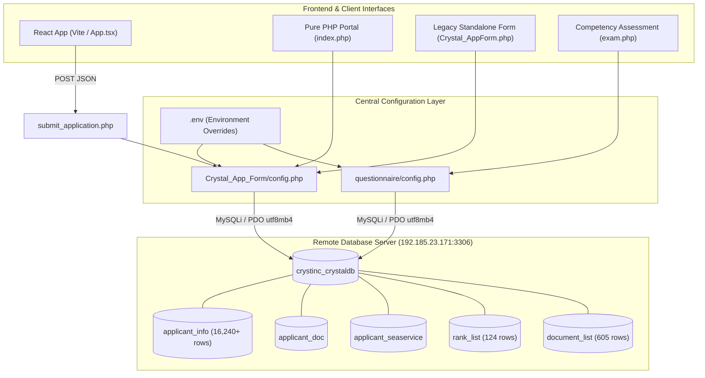

# Crystal Shipping Inc. - Remote Database Integration & Localhost Decoupling
## Technical Decisions, Architecture & Implementation Documentation

**System**: Seafarer Application Portal & Seafarer Evaluation System  
**Organization**: Crystal Shipping Inc.  
**Database**: `crystinc_crystaldb` (MySQL 5.7+ / MariaDB)  
**Host Target**: `192.185.23.171:3306`  
**Date**: October 5, 2026  

---

## 1. WHAT DID WE BUILD?

We built a **unified, remote database integration architecture** that decouples the entire Crystal Application Portal (`Crystal_App_Form`) and the Seafarer Assessment Portal (`questionnaire`) from local machine dependencies (`localhost` / XAMPP local MySQL).

### Core Components Implemented:
1. **Centralized Configuration & Remote Database Connector (`Crystal_App_Form/config.php`)**:
   - Environment-variable-driven DB credentials with fallback to the live remote server:
     - `DB_HOST`: `192.185.23.171`
     - `DB_USER`: `crystinc_ojt`
     - `DB_PASS`: `Cry$talOJT2026`
     - `DB_NAME`: `crystinc_crystaldb`
     - `DB_PORT`: `3306`
   - Zero-dependency `.env` file loader for simple configuration changes across deployment environments.
   - Robust `mysqli` connection with `utf8mb4` charset and standardized error reporting.
   - Optional PDO helper `getPdo()` for queries requiring PDO.
2. **Standardized Database Access Helper (`Crystal_App_Form/db.php`)**:
   - Provides consistent access to both `$db` (mysqli) and `$pdo` (PDO) across modular scripts.
3. **Decoupled Standalone Application Form (`Crystal_App_Form/Crystal_AppForm.php`)**:
   - Replaced hardcoded `const DB_HOST = 'localhost'` and local credentials with `require_once __DIR__ . '/config.php'`.
   - Now fetches active document types directly from `document_list` on the live database.
4. **Decoupled React API Endpoint (`Crystal_App_Form/submit_application.php`)**:
   - Replaced hardcoded `new mysqli('localhost', 'crystinc_crystal', ...)` with `require_once __DIR__ . '/config.php'`.
   - Provides atomic transactions (`applicant_info`) and duplicate detection directly against the live database.
5. **Database-Connected Pure PHP Portal (`Crystal_App_Form/index.php`)**:
   - Connected form submission to the remote database: automatically validates duplicates, uploads applicant photos, inserts into `applicant_info`, stores documents in `applicant_doc`, and persists sea service history in `applicant_seaservice` within a database transaction.
   - Dynamically populates the "Position Applied" select dropdown from the live `rank_list` table (124+ ranks), with graceful fallback to standard maritime categories.
   - Generates and presents official applicant reference numbers (`CSI-XXXXXX`) upon successful submission.
   - Added `enctype="multipart/form-data"` to the form for photo uploads and user-facing error banners.
6. **Unified Questionnaire Database Layer (`questionnaire/config.php` & `questionnaire/db.php`)**:
   - Added `.env` loader and `DB_PORT` support to `questionnaire/config.php`.
   - Updated `questionnaire/db.php` from `localhost` / `root` to inherit the remote database configuration.
   - Updated `questionnaire/Crystal_AppForm.php` to use `config.php`.

---

## 2. WHY DID WE BUILD IT?

### The Problem
Previously, key scripts in `Crystal_App_Form` and `questionnaire` were hardcoded to `localhost`:
- `Crystal_App_Form/Crystal_AppForm.php` was hardcoded to `const DB_HOST = 'localhost'`.
- `Crystal_App_Form/submit_application.php` was hardcoded to `$db = new mysqli('localhost', 'crystinc_crystal', ...)`.
- `questionnaire/db.php` was hardcoded to `define('DB_HOST', 'localhost')`.
- `Crystal_App_Form/index.php` was storing applications purely in `$_SESSION` without persisting to the database.

Because of this:
1. **Local Machine Lock-in**: The system required a locally running MySQL service in XAMPP on port 3306 with specific local users configured (`crystinc_crystal` or `root`).
2. **No Data Centralization**: Applications submitted locally did not reach the central company database where recruitment personnel review applicants.
3. **Broken Portability**: If code was moved to another workstation, staging server, or cloud hosting, it failed with connection errors.

### The Objective
Connect the entire codebase to the remote database (`192.185.23.171` / `crystinc_crystaldb`) so that all components (pure PHP forms, React frontends, assessment questionnaires) operate independently of `localhost` and share one central data store.

---

## 3. HOW DOES IT WORK?

### Connection Architecture

### Data Flow for Applicant Submission (`index.php` & `Crystal_AppForm.php`):
1. **Validation & Duplicate Verification**:
   The server checks `applicant_info` using prepared statements matching `App_LName`, `App_FName`, `App_Bday`, `App_MobileNo`, and `App_EmailAdd`.
2. **Transaction Initiation**:
   `$db->begin_transaction()` ensures that partial data is never committed if an error occurs.
3. **Core Profile Insertion (`applicant_info`)**:
   Applicant personal details, contact channels (Viber, WhatsApp, Skype, Facebook), and employment status are stored.
4. **Child Records Insertion**:
   - `applicant_doc`: Primary documents (Passport, SIRB, GOC, COC, SID, E-Reg) and dynamic training certificates.
   - `applicant_seaservice`: Prior shipboard experiences, vessel details, GRT, engine power, dates, and calculated durations.
5. **Commit & Reference Number Generation**:
   `$db->commit()` seals the record and generates a formatted reference number (`CSI-` + 6-digit padded ID), stored in session for the examinee's confirmation screen.

---

## 4. WHAT ALTERNATIVES EXISTED & WHY WERE THEY REJECTED?

| Alternative | Description | Why Rejected |
| :--- | :--- | :--- |
| **A. Keep Localhost MySQL & Replicate via Dump/Sync** | Keep developers using local MySQL in XAMPP and run periodic sync scripts or manual SQL dumps to the remote server. | **Rejected**: Fragile, introduces data drift, requires manual developer maintenance, and prevents live testing against real recruitment tables. |
| **B. Docker Compose Local Container** | Package a local MySQL container for developers to run on their machines. | **Rejected**: Still leaves the application dependent on a local database instance rather than connecting to the live, existing Crystal database that the questionnaire already uses. |
| **C. REST API Middleware** | Create a separate microservice / REST API between PHP and MySQL. | **Rejected**: Overkill for standard PHP deployment; adds latency and another service point of failure without tangible benefits given that MySQL is directly reachable over TCP port 3306. |
| **D. Centralized Remote Connection with .env Fallback (Selected)** | Configure PHP scripts to connect directly to `192.185.23.171` with `getenv()` / `.env` fallback. | **Selected**: Immediate portability, completely eliminates localhost dependency, guarantees all apps share live data, and permits zero-code environment overrides. |

---

## 5. WHAT WENT WRONG & HOW PROBLEMS WERE SOLVED

### Issue 1: MySQL 5.7 / MariaDB Privilege Inspection Syntax
- **What happened**: Attempting to run `SELECT CURRENT_ROLE()` during database verification triggered a fatal exception: `FUNCTION crystinc_crystaldb.CURRENT_ROLE does not exist`.
- **Cause**: The remote database is running MySQL `5.7.44-48`, which does not support SQL:2016 roles (`CURRENT_ROLE()`).
- **Fix**: Replaced the diagnostic check with standard `SELECT CURRENT_USER()`. Verified active user `crystinc_ojt@146.88.79.74` with full read/write permissions.

### Issue 2: Constant Redefinition Notices When Requiring Multiple Configs
- **What happened**: During cross-module testing where test scripts included both `Crystal_App_Form/config.php` and `questionnaire/config.php`, PHP emitted notices: `Constant DB_HOST already defined`.
- **Cause**: PHP `define()` was invoked unconditionally.
- **Fix**: Wrapped all configuration constants in `if (!defined('CONSTANT')) define(...)` guards across both configuration files.

### Issue 3: Incomplete Persistence in `index.php`
- **What happened**: Inspection of `Crystal_App_Form/index.php` revealed it merely stored POST data into `$_SESSION['application_data']` without writing anything to MySQL.
- **Cause**: `index.php` was previously built as a UI prototype.
- **Fix**: Implemented complete server-side insertion into `applicant_info`, `applicant_doc`, and `applicant_seaservice` matching the live schema, with duplicate checks and transaction rollback.

---

## 6. WHAT TRADE-OFFS WERE ACCEPTED?

1. **Network Latency vs. Localhost Speed**:
   - *Gained*: Centralization, instant portability, no local MySQL requirement, real-time sync with recruitment team.
   - *Accepted*: Remote TCP round-trip latency (~50-150ms depending on Internet connection) for queries compared to 1ms on local disk.
2. **Remote Port Exposure**:
   - Connecting to port 3306 on `192.185.23.171` requires the remote MySQL server's firewall to allow inbound connections from authorized client IPs or wildcard hosting.

---

## 7. VERIFICATION & TEST RESULTS

A complete automated test suite (`scratch/test_all_db_connections.php`) was executed:
- `Crystal_App_Form/config.php`: **PASS** (connected to `192.185.23.171`, verified 16,241 rows in `applicant_info`)
- `Crystal_App_Form/db.php (PDO)`: **PASS** (verified 124 ranks in `rank_list`)
- `questionnaire/config.php`: **PASS** (verified 605 documents in `document_list`)
- `questionnaire/db.php (PDO)`: **PASS** (verified PDO connection)
- `rank_list` sample query: **PASS** (`AB/Cook`, `AB/Crane Operator`, `AB/Excavator`, `AB/Fitter`, `AB/Forklift`)
- Simulated application insert & rollback: **PASS** (`App_ID 29084` created and safely rolled back)
- PHP Syntax Linting across all files: **PASS** (0 errors)

---

## 8. WHAT SHOULD HAPPEN NEXT?

1. **SSL/TLS Database Encryption**:
   If the remote database supports MySQL SSL (`MYSQLI_CLIENT_SSL`), add SSL certificate configuration to encrypt database credentials and applicant personal information in transit over public networks.
2. **File Storage Modernization**:
   Applicant uploaded photos and documents are currently stored on the local web server filesystem (`uploads/`). In a distributed multi-server deployment, migrate storage to an S3-compatible cloud object store or shared volume.
